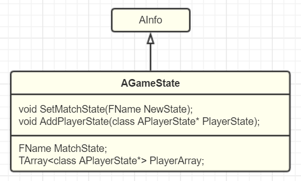

# Object->Actor+Component->Level->World->WorldContext->GameInstance->Engine


跟cocos里node代表一切 两种设计思想

1. **UObject** ，反射序列化等机制
2. **UActorComponent** ，功能的载体，一定程度的嵌套组装能力（SceneComponent）
3. **AActor** ，基础的游戏对象，Component的容器
4. **APawn** ，分化出来的AActor，物理表示和基本的移动能力，当前正翘首以待。
5. **没了** ，在控制Actor这个层级，我们还暂时不需要去考虑Level等更高层次的对象


AActor增删组件接口

```
**
 * Puts a component in to the OwnedComponents array of the Actor.
 * The Component must be owned by the Actor or else it will assert
 * In general this should not need to be called directly by anything other than UActorComponent functions
 */
void AddOwnedComponent(UActorComponent* Component);

/**
 * Removes a component from the OwnedComponents array of the Actor.
 * In general this should not need to be called directly by anything other than UActorComponent functions
 */
void RemoveOwnedComponent(UActorComponent* Component);
```





